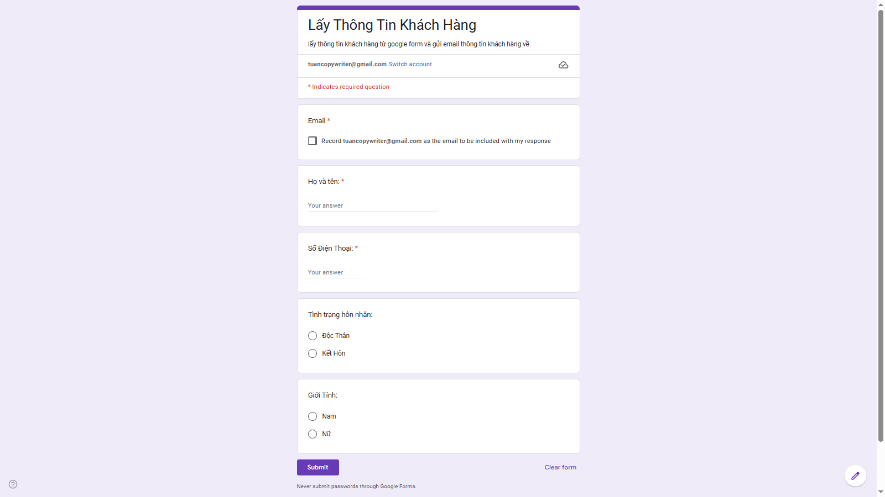
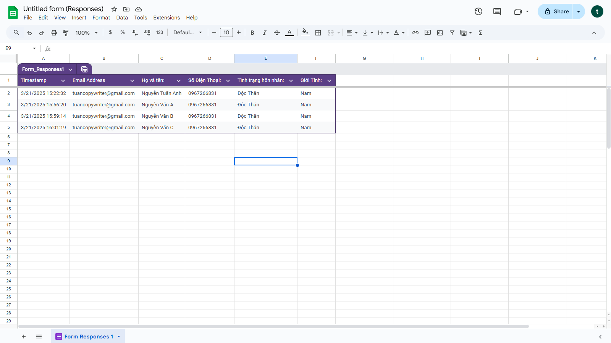
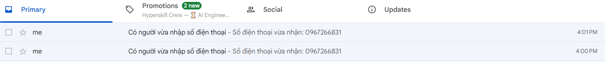

# Auto Email Registration

A simple automation using Google Apps Script that sends a confirmation email to users after they submit a Google Form.

## 🔧 Features
- Collects data from a Google Form to Google Sheets
- Automatically sends a personalized email to the user
- Email is only sent if a valid email address is entered

## 📁 Project Structure
- `code.gs`: Main script to handle the email sending
- `form-preview.png`: Google Form used to collect data
- `sheet-preview.png`: Google Sheet where responses are stored
- `email-sent.png`: Example of the email sent

## 🛠 Technologies
- Google Apps Script
- Google Forms
- Google Sheets
- Gmail API

## 📷 Screenshots

| Google Form | Google Sheet | Sent Email |
|-------------|---------------|------------|
|  |  |  |

## 📬 Email Logic
When a new row is added to the Google Sheet, the script checks if the email is valid, then sends a custom confirmation email.

## 🔗 Live Demo (optional)
> Add link to your Google Form here if public
